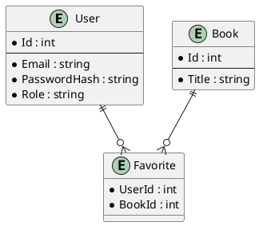

# Online Library API

A REST API for an online library that allows you to manage books, favorites, and user roles. This project is built with .NET, uses PostgreSQL for data storage, and provides JWT authentication with role-based access control.

---

## ⚙️ Key Features

- **Registration and Login** (JWT-based)
- **Roles**: `admin` and `client`
- **CRUD** for books (add, delete, view)
- **Favorites** (add / remove books to user-specific favorites)
- **Export books to CSV** (admin only)
- **Migrations** and PostgreSQL via EF Core

---

## 📂 Table of Contents

1. [Requirements](#requirements)
2. [Setup and Run](#setup-and-run)
3. [Console Commands](#console-commands)
4. [Database Structure](#database-structure)
5. [User Management](#user-management)
6. [API Endpoints](#api-endpoints)
7. [UML Diagrams](#uml-diagrams)
8. [Answers to Theoretical Questions](#answers-to-theoretical-questions)

---

## Requirements

- [.NET 8 SDK](https://dotnet.microsoft.com/en-us/download)
- [PostgreSQL](https://www.postgresql.org/download/) (any recent version)
- [dotnet-ef](https://learn.microsoft.com/en-us/ef/core/cli/dotnet) (optional, for migrations)

> **Important**: Make sure PostgreSQL is running and that your `appsettings.json` has the correct `Host`, `Port`, `Username`, `Password`, and `Database`.

---

## Setup and Run

1. **Clone the repository**:

   ```bash
   git clone https://github.com/Siropzik/OnlineLibraryAPI.git
   cd OnlineLibraryAPI
   ```

2. **Configure the database connection** in `appsettings.json`:

   ```json
   {
     "ConnectionStrings": {
       "DefaultConnection": "Host=localhost;Port=5432;Database=online_library;Username=postgres;Password=yourpassword"
     },
     "Jwt": {
       "Secret": "wJalrXUtnFEMI/K7MDENG+bPxRfiCYEXAMPLEKEY"
     }
   }
   ```

3. **Apply migrations** (if not applied yet):

   ```bash
   dotnet ef database update
   ```

4. **Build and run**:

   ```bash
   dotnet build
   dotnet run
   ```

5. **Open Swagger**: [http://localhost:5230/swagger](http://localhost:5230/swagger)

---

## Console Commands

### Change User Role

```bash
dotnet run set-role <email> <admin|client>
```

Example:

```bash
dotnet run set-role admin@lib.com admin
```

### Clear Database (if implemented)

```bash
dotnet run clear-db
```

Removes all users and books (IDs are reset).

---

## Database Structure

In **PostgreSQL**, the following tables are created:

- **Users** (Id, Email, PasswordHash, Role)
- **Books** (Id, Title, Authors, Genres)
- **Authors** (Id, Name)
- **Genres** (Id, Name)
- **Favorites** (UserId, BookId)

---

## User Management

1. **Registration** – `POST /api/auth/register`
2. **Login** – `POST /api/auth/login` (JWT)
3. **Default role** – `client`
4. **Change role** – via console command `dotnet run set-role email@lib.com admin`

---

## API Endpoints

### Auth

| Endpoint                      | Description         |
| ----------------------------- | ------------------- |
| **POST** `/api/auth/register` | Register a new user |
| **POST** `/api/auth/login`    | Login (JWT token)   |

### Books

| Endpoint                     | Description                          |
| ---------------------------- | ------------------------------------ |
| **GET** `/api/books`         | Get all books (no login required)    |
| **GET** `/api/books/{id}`    | Get a book by ID (no login required) |
| **POST** `/api/books`        | Add a new book (admin only)          |
| **DELETE** `/api/books/{id}` | Delete a book (admin only)           |
| **GET** `/api/books/export`  | Export books to CSV (admin only)     |

### Favorites

| Endpoint                             | Description                                 |
| ------------------------------------ | ------------------------------------------- |
| **POST** `/api/favorites`            | Add a book to favorites (login required)    |
| **DELETE** `/api/favorites/{bookId}` | Remove a book from favorites (login, owner) |
| **GET** `/api/favorites`             | Get current user’s favorites (login)        |

---

## UML Diagrams

- **ERD**: [uml/ERD.puml](uml/ERD.puml)
- **Class Diagram**: [uml/ClassDiagram.puml](uml/ClassDiagram.puml)



---

## Answers to Theoretical Questions

1. **1.1** (logical (false))
2. **2** (logical (true))
3. **2 (10)**
4. **2 (10)**
5. **3** (Exception is thrown)
6. **1 (5)**
7. **2 (10)**
8. **7** (Exception is thrown)
9. **1** (Executes successfully)
10. **3 (dog move)** and **5 (animal move)**
11. **5 and 6** (Animal breathing twice)
12. **3** (Everything depends on composer.lock if it exists in the vendor directory, otherwise uses composer.json, and after creating composer.lock)
13. **2** (Everything is installed from composer.json even if composer.lock is present, then we update composer.lock)
14. **1** (`composer require <packageName>`)
15. **3** (1.2.X)

### 16. SQL

```sql
SELECT
    a.id AS article_id,
    a.title AS article_title,
    a.body AS article_body,
    c.id AS comment_id,
    c.title AS comment_title,
    c.body AS comment_body,
    c.parent_id AS comment_parent_id
FROM
    articles a
        JOIN
    comments c ON a.id = c.article_id
WHERE
    a.id = 101;
```

**Equivalent in C#:** (using EF Core)

```csharp
var query = from a in context.Articles
            join c in context.Comments on a.Id equals c.ArticleId
            where a.Id == 101
            select new
            {
                article_id = a.Id,
                article_title = a.Title,
                article_body = a.Body,
                comment_id = c.Id,
                comment_title = c.Title,
                comment_body = c.Body,
                comment_parent_id = c.ParentId
            };
```

### 17. SQL

```sql
SELECT
    u.id AS user_id,
    u.email,
    p.first_name,
    p.last_name,
    p.photo_link,
    r.title AS role_title
FROM
    users u
        JOIN
    profiles p ON u.id = p.user_id
        JOIN
    users_roles ur ON u.id = ur.user_id
        JOIN
    roles r ON ur.role_id = r.id
WHERE
    u.id = 256;
```

**Equivalent in C#:**

```csharp
var result = from u in context.Users
             join p in context.Profiles on u.Id equals p.UserId
             join ur in context.UsersRoles on u.Id equals ur.UserId
             join r in context.Roles on ur.RoleId equals r.Id
             where u.Id == 256
             select new {
                 user_id = u.Id,
                 email = u.Email,
                 first_name = p.FirstName,
                 last_name = p.LastName,
                 photo_link = p.PhotoLink,
                 role_title = r.Title
             };
```

### 18. SQL

```sql
INSERT INTO users_roles (user_id, role_id)
VALUES (225, 8);
```

**Equivalent in C#:**

```csharp
// using EF
var newUserRole = new UsersRoles {
    UserId = 225,
    RoleId = 8
};
context.UsersRoles.Add(newUserRole);
context.SaveChanges();
```

### 19. SQL

```sql
UPDATE profiles
SET photo_link = 'new_photo_link'
WHERE user_id = 67;
```

**Equivalent in C#:**

```csharp
var profile = context.Profiles.FirstOrDefault(p => p.UserId == 67);
if (profile != null)
{
    profile.PhotoLink = "new_photo_link";
    context.SaveChanges();
}
```

### 20. SQL

```sql
DELETE FROM profiles
WHERE user_id = 78;

DELETE FROM users_roles
WHERE user_id = 78;

DELETE FROM comments
WHERE author_id = 78;

DELETE FROM users
WHERE id = 78;

-- if foreign keys are set with ON DELETE CASCADE, this single query is enough:
DELETE FROM users
WHERE id = 78;
```

**Equivalent in C#:**

```csharp
// Example with EF Core
// if we do not have Cascade Delete, we remove them manually:

var userId = 78;

// profiles
var prof = context.Profiles.FirstOrDefault(p => p.UserId == userId);
if (prof != null) context.Profiles.Remove(prof);

// user_roles
var userRoles = context.UsersRoles.Where(ur => ur.UserId == userId).ToList();
context.UsersRoles.RemoveRange(userRoles);

// comments
typeof( /* depends on your "comments" entity linking */ );

// finally, remove from users
typeof( /* remove user with Id=78 */ );

// Save all changes
context.SaveChanges();
```

